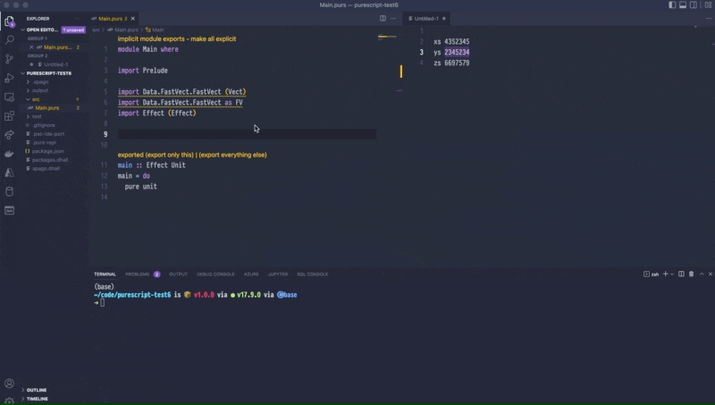

# purescript-fast-vect 🐆

Fast, type-safe vector libary for Purescript inspired by [Idris](https://www.idris-lang.org/). A vector is list with its size encoded in the type.



## Installation

```bash
spago install fast-vect
```

## Long story

A vector is a list (or an Array in the case of Purescript) that has its size encoded in the type. For instance in Idris you can define a vector like this:

```idris 
vect : Vect 3 Int 
vect = [1,2,3]
```

Note the value `3` in the type position, indicating that the vector has exactly three elements.

In `purescript-fast-vect` we can define the same three element vector like this:

```purescript 
vect :: Vect 3 Int
vect = 1 : 2 : 3 : empty
```

What is this good for you ask? Well, now that we have the size encoded in the type, the compiler can help us find errors. For instance, the compiler can tell us when we try to access the head of an empty list. 

This leads to a slightly different design of the api. E.g. the `head` function in `Data.Array` has the following type signature:
```purescript
head :: forall a. Array a -> Maybe a
```
So if you call head on an `Array`, you have to handle the `Maybe`. 
In contrast, `head` in `Data.FastVect` has the following type signature (conceptually - the real one is slightly more complex) :
```purescript
head :: forall m elem. Vect m elem -> elem
```
You will get an `elem` back, no need to handle a `Maybe`. And this operation is always safe, because in the case that the vector is empty you will get a compile-time error. 

Similarly, the `index` function has the following type signature (conceptually - the real one is slightly more complex):
```purescript
index :: forall @i m elem. Vect m elem -> elem
```
If the index `i` (represented as a typelevel symbol) is in bounds, i.e. `i < m`, you will get an `elem` back, otherwise you will get a compile-time error. 

Furhter functions that are defined differently to the `Array` functions are:

* `take` is guaranteed to return you a vector with the number of elements requested and result in a compile-time error if you are trying to request more elements than are in the vector. 
* `drop` is guaranteed to drop the exact number of elements from the vector and result in a compile-time error if you are trying to drop more elements than exist in the vector.

You can find the full api on [pursuit](https://pursuit.purescript.org/packages/purescript-fast-vect/latest/docs/Data.FastVect.FastVect). 

### Example usage 

```purescript
import Prelude

import Data.FastVect.FastVect (Vect)
import Data.FastVect.FastVect as FV

as :: Vect 300 String
as = FV.replicate @300 "a"
-- Note: you can leave out the type annotation, as PS can infer it:
-- as = FV.replicate @300 "a"

bs :: Vect 200 String
bs = FV.replicate @200 "b"

cs :: Vect 500 String
cs = FV.append as bs

ds :: Vect 2 String
ds = cs # FV.drop @299 # FV.take @2

x :: String
x = FV.index @499 cs

y :: String
y = FV.head (FV.singleton "a")

big1 :: Vect 23923498230498230420 String
big1 = FV.replicate @23923498230498230420 "a"

big2 :: Vect 203948023984590684596840586 String
big2 = FV.replicate @203948023984590684596840586 "b"

big :: Vect 203948047908088915095071006 String
big = FV.append big1 big2
-- Note: the big example will blow up during runtime. Need to increase Node.js memory for this ;)
```
